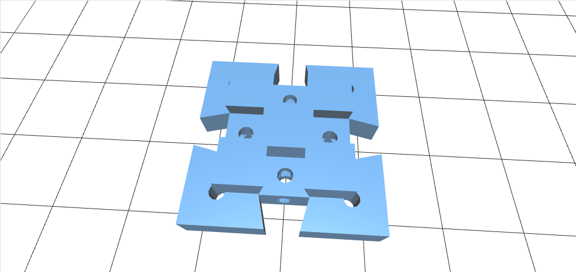
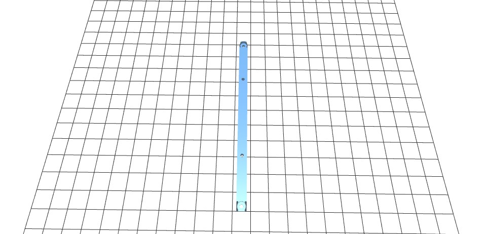
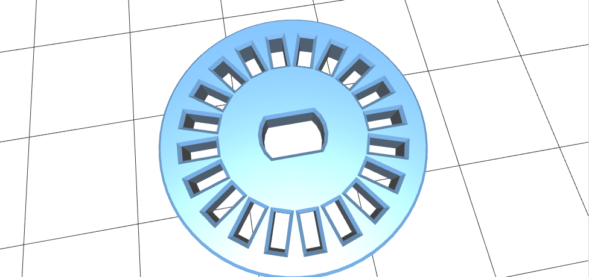

#  Tutorial de montagem do toninho 

esse tutorial está dividido em 3 partes:

* ### 1° parte: impressão das peças  
* ### 2° parte: marcações (aonde cada peça vai estar)
* ### 3° parte: montagem  

## 1° parte:  impressão

**OBS: eu não vou ensinar como utilizar  a impressora 3D  então, caso não saiba  procure as pessoas responsaveis**

vamos la!   
primeiro passo para ter um toninho para chamar de seu é imprimir as peças:  

 impirima `4 encaixes: `  
<<<<<<< HEAD
  
=======
  
>>>>>>> e337a96a33b398ac8d67efbc24b7b1a4ffef1a75

[link para download](https://drive.google.com/open?id=0B1uMptwQ0YA9NEg5VWc4U3E1MXM)

`4 hastes de 100m`
<<<<<<< HEAD

=======

>>>>>>> e337a96a33b398ac8d67efbc24b7b1a4ffef1a75

[link para download](https://drive.google.com/open?id=0B1uMptwQ0YA9SHpia00xSVJROFE)

`2 hastes de 80m`
<<<<<<< HEAD

=======

>>>>>>> e337a96a33b398ac8d67efbc24b7b1a4ffef1a75

[link para download](https://drive.google.com/open?id=0B1uMptwQ0YA9V2dqd01JcFVzZFU)

 `2 contadores de giros`  
<<<<<<< HEAD
 
=======
 
>>>>>>> e337a96a33b398ac8d67efbc24b7b1a4ffef1a75
 
 [link para download](https://drive.google.com/open?id=0B1uMptwQ0YA9MVhpaEp3d1lCS3c)

 `2 slots baterias` (**OBS: a foto mostra um slot**)
<<<<<<< HEAD
 
=======
 
>>>>>>> e337a96a33b398ac8d67efbc24b7b1a4ffef1a75
   
 [link para download](https://drive.google.com/open?id=0B1uMptwQ0YA9X281WFp6ei16dGM)

 ` 1 suporte para o motor direito`
<<<<<<< HEAD
 
=======
 
>>>>>>> e337a96a33b398ac8d67efbc24b7b1a4ffef1a75

 [link para download](https://drive.google.com/open?id=0B1uMptwQ0YA9ZVhHMjhsMWtTQnc)

 `1 suporte para o motor esquerdo`
<<<<<<< HEAD

=======

>>>>>>> e337a96a33b398ac8d67efbc24b7b1a4ffef1a75

 [link para download](https://drive.google.com/file/d/0B1uMptwQ0YA9T1NIY0FMTHNkZmc/view?usp=sharing)

